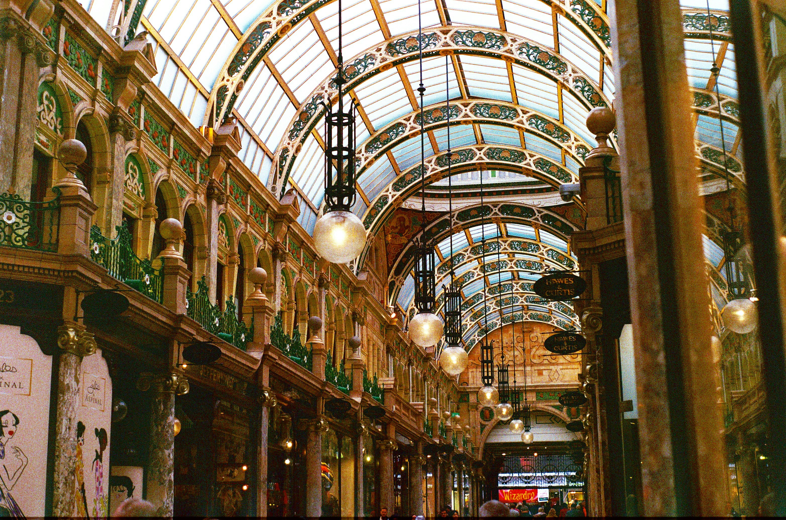

<pre>{{ description }}</pre>

  [Photo by <a href="https://unsplash.com/@sherwinphotography">Oliver Sherwin</a>]

## I remember you, from online

The bloody and untimely demise of Twitter has sincerely been one of the great tragedies of my online
life. For all of it's chaotic circuitry (and Christ, there was a _rat's nest_ of chaotic circuitry),
my time on Twitter ended up being overwhelmingly good to me. Everything that surrounded the sad and
dark thing that happened to the platform, the gifted people that worked there and its earned
position in global information - well, it is something that I consider to be one of the many great
sadnesses of the modern web. For reasons that are at this point, well documented, it rolls forward
in its own way, to a fractal of effects that are clear to see. I don't think that the specifics of
that are something I'd write about, for complicated reasons that I am still trying to organise in my
mind.

The capture of Twitter exploded a large portion of my social graph, and 13 years of human
connection. It messily dispersed friendships, professional relationships - and the niche communities
I love that drive forward the arts, technology and social projects that characterise my adult life.
It was a lifeline during a pandemic that locked me into my apartment for almost 4 months, alone. I
met someone on Twitter, who later held me at my wedding. A number of my closest adult relationships
exist in their richness today because of the _The Bird Site_. Because of all of this, it felt
complicated to extract myself from the only place on the Internet that I had managed to make a home
of. It felt complicated because _the Internet is real life_, and it has been a long time since it
wasn't. And I suppose, also, because one of big tech's only consistent cultural behaviours
throughout the last 25 years has been it's noxious habit of abandoning, abusing, collapsing or
co-opting online places in an effort to satisfy the bottomless appetites of their owners. I
understand this is a pessimistic way to read things - but I am still pissed off about this. There is
however, good news: I am no longer ashamed to say "the place was important to me" and the majority
of my most meaningful connections, I was capable, over time, of saving.

**Which is all to say: I was fucking using that. Put it back. Get out of the kitchen.**

## Optimism kills the blood machine

I suppose none of this is a dynamic entirely unique to Internet companies, given the incentives
wound into the blood machines of our capital markets. But the industry has not only _not resisted_
the call; it has elected it as a blueprint for future homes, so to speak. The operating model of
many of the corporations - that have deliberately consolidated an astonishing position of influence
over the most powerful communication infrastructure in history - is so far away from the promise of
their original vision. It is unrecognisable. It was never supposed to burn out like this. It was
exciting, new and hopeful to be a creative, or a builder or a user of the Internet. Being a software
engineer for a startup was somehow a cool thing. Some sort of digital prospecting for the next wave
of ideas to move our connection forward. But, an infrastructure co-opted by an untouchable oligopoly
of Ivy League computer science graduates is the antithesis of the potential of a free and open
Internet. The brilliant people that built the god-forsaken place are still here to remember that
vision, because in relative terms, the technology is still brand new. There is a sort of grief among
many of us about the political and civic ramifications of 75 billion, simultaneous computer
connections that I don't think that many of us expected to have to bear.

This has been an almost constant point of tension for me, as someone who loves to build and make
Internet things - but cannot ignore the uncomfortable feeling of moving through a world distorted
and irreparably changed by the Internet. It has in recent years felt difficult not be cynical,
suspicious, disappointed or outright furious about an environment of venture roulette games that
have ushered in some of the most hostile technology initiatives since the advent of the personal
computer. This had of course, over time, greatly diminished my appetite for going to things like
conferences, hack sessions and meet-ups. Unsurprisingly, my appetite to hear about another product
that solves a luxury problem for a luxury person has been worn down to nothing.

But the unexpected corollary of all of this: **I think I am feeling optimistic again** and I want to
build and share things again.

I have somehow managed to keep a small and meaningful circle of friends from Twitter that for one
reason or another I have never been able to orchestrate finding time with in person. In a sort of
miracle of geography and scheduling, it turns out that we were almost all able to make it to the
excellent <a href="https://heypresents.com/conferences/2025" target="_blank">All Day Hey! 2025</a>,
which for some of us was the first conference event that we'd been to since The Beforetimes. I share
this because being able to bring this collection of people together in the same space, after years
of missing one another - felt like a transformative affair that has really gone some way to
repairing an otherwise fractured nature that made it hard for me to feel excited about the future of
our work. There is a special restorative power in recasting Your Friends From The Internet into
their personhood. Finding that there are still people thinking about hard things, differently.
Understanding that the way that **we live together online** is just the way that **we live
together**. Finding that the bonds are the same in the signals as they are in the flesh. Where the
micro is the macro, this is a vital rediscovery that is key to the optimism required to Build Better
Things.

Against the backdrop of a very decent collection of speakers, strong coffee and pillowy red velvet
sofas, I couldn't help but feel struck by the power of the good people that are somehow still
designing and building this future together. This is an industry _packed_ with sensitive,
thoughtful, sharp, talented people who still give a shit about how to make things right. It is also
an industry with a strange, hilarious and ridiculous history reflective of a wider, completely
absurd story of Human Computer Interaction.

It strikes me that if we are looking for the people that will be a force for positive change through
the lens of the next chapter of the independent web - that they are already here because they are
already us. And we already know what to do because of how doing what is right makes us feel. And we
just need to say the things that we know are right and good for human beings loudly and clearly and
without apology, and without saying 'Does that make sense?' at the end of the sentence. And then we
need to do those things with the many allies that believe the Internet should be an accessible,
equitable and profound revolution in the story of the way that human beings relate to one another.
This actual manifestation - often at the expense of our own personal reward - is the only thing that
wins out against a matrix of incentives that otherwise arc towards the seductive pull of our darker
and more selfish nature. Many of us are taking new and more influential positions in our
institutions and communities, or in companies driving what the web looks like into the next chapter.
There will be difficult things to do to equalise and stabilise against and even reverse the way
things work today. The bad news is that it will often be difficult to use our positions of influence
to do the right thing. The good news is that there is no choice but to do those things.

## The work of forever

It also lands on me that every empire is eventually a ruin. And its decay begins at the exact moment
that its makers forget that civic structures are always eventually collapsed by their lack of
ability to manage their eventual resulting complexity. The work of forever is in the maintenance,
and in the nourishment, and not the draw of novelty. Most overwhelming success is repetition; and
every time we have to decide to build something better than we built it before, we bring with it a
revitalised and precious cargo of experience, care and righteous energy. There is no reason to call
for help; the people who know how to help are already here.

The hardest part about any kind of progressivism is that we cannot agitate for better alternatives
by romanticising the things we have already done. We do not have the luxury of nostalgia because
romancing the way we got here delivers no new ideas on how to fix the things that we did not do
well, fairly or safely. Nostalgia is useless where we have to go. We must build simpler, more
effective things in small ways together. There is no linearly replacing one thing with another. New
alternatives must be built in parallel to the things that must be unseated. They must be built
sufficiently carefully that they are undeniable as a forward trajectory. We must improve the things
we work on today in the small ways that we can, as a first-order priority. And to make them stick,
we must do them consistently. We must explain ourselves repeatedly and clearly and without
scolding - especially when that feels really hard. And most of all, we must demonstrate that the
results of Making Better Things are their own reward - well beyond
<a href="https://bell.bz/im-getting-fed-up-of-making-the-rich-richer/" target="_blank">making the
line go up</a> at another company that exists to sell advertising to companies hawking next year's
landfill.

It has been a long time since I believed that it might still be possible to do new, interesting and
impactful things online together again. And I am looking for the people who are already here, who
think that could be possible too. I am looking for the people who want to stay eager with me.

<blockquote>
  “Do stuff. Be clenched, curious. Not waiting for inspiration's shove or society's kiss on your
  forehead. Pay attention. It's all about paying attention. Attention is vitality. It connects you
  with others. It makes you eager. Stay eager.” - Susan Sontag
</blockquote>

There is so much for us to do.

Until tomorrow. 🕶🖤
